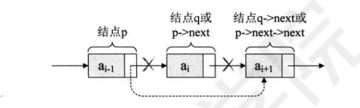
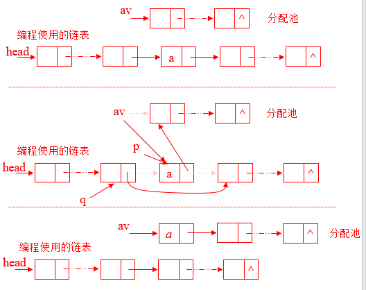

## 线性表

        1. 线性表是一组有序、有限的数据元素
        2. 除第一个元素外，其它每个元素都仅有一个直接前趋元素
        3. 除最后一个元素外，其它每个元素都仅有一个直接后继元素
        4. 线性表中的数据元素是有序排列的，既 ( a，b ) ≠ ( b, a )
        5. 不论是什么数据类型，所有元素的数据类型都一样

#### 线性表的基本操作

        1. 线性表的声明、创建和初始化
        2. 数据元素的插入、删除、修改
        3. 数据元素的查找、排序
        4. 线性表的释放
        5. 组合、进阶

#### 线性表的具体存储方式

      1. 顺序存储
      2. 链表存储(包括单向链表、双向链表、循环链表)

#### 顺序存储的线性表

      1. 存储地址的计算：
                addr(ai) = addr(a1) + (i – 1) * element_size
                (element_size是一个数据元素所占存储单元的数目)
      2. 声明：
                int a[50], char a[30]
        要素：
                (1).线性表的最大长度 max_size
                (2).正在使用的长度 n
                (3).初始化时，n=0, 增加一个元素：n=n+1;减少一个元素：n=n-1
      3. 操作实现
                3.1插入
                        3.1.1在结尾插入
```cpp
//伪代码
/*
AppendList (V, n, x)
{
    V[n+1] = x
    n = n + 1
}
*/

//声明、定义
#include "stdio.h"
#define maxsize 10
typedef struct list{
    int array[maxsize];
    int flag;
}list;

//定义插入函数

void Insert(list L, int x){
    L.array[L.flag+1] = x ;
    for(int k=0; k<=L.flag+1; k++){
        printf("%d ",L.array[k]);
    }
}


//定义主函数
int main(){
    list L;
    int x;
    char st;
    int i;
    printf("请输入一组数(用逗号隔开，最大长度为9)\n");
    for(i = 0; st!='\n'; i++){
        scanf("%d", &L.array[i]);
        L.flag = i;
        st = getchar();
    }
    printf("请输入要插入的数\n");
	scanf("%d", &x);
    Insert(L, x);	
}
```
                        3.1.2在非尾处插入
```cpp
//伪代码
/*
InsertList(V, n, i, X){
    if(n >= maxsize){
        表满,return
    }
    if(i<1) or (i>n+1) then{
        参数i错误,return
    }
    else {
        for j = n to i step-1
            V[j+1]=V[j]
        end(j)
        V[i] = X
        n = n+1
        return
    }
}
*/
#include "stdio.h"
#define maxsize 10

//初始化
typedef struct list{
    int array[maxsize];
    int flag;
}list;

//定义插入函数
void InsertList(list L, int x, int y){
    int i,j;
    if(y<=0||y>L.flag+1)     //判断插入的位置是否正确，也可以定义一个函数
        printf("插入的位置有误\n");
    else{
    for(i=L.flag;i>y-2;i--){
        L.array[i+1] = L.array[i];
    }
    L.array[y-1]=x;
    L.flag++;
    for(j=0;j<L.flag+1;j++)
		printf("%d ",L.array[j]);
    }
    
}

//定义主函数
int main(){
	list L;
	char st;
	int i;
	int x,y;
	printf("请输入一组数（用逗号隔开）\n");
	for(i=0;st!='\n';i++){
		scanf("%d",&L.array[i]);
		L.flag=i;
		st=getchar();
	}
	printf("请输入要插入的数：\n");
	scanf("%d",&x);
	printf("请输入插入的位置：\n");
	scanf("%d",&y);
	InsertList(L,x,y);	
}
```
                3.2删除
```cpp
//伪代码
/*
DeleteList(V, n, i){
    if(i<1)or(i>n) then {
        参数i错误，return
    }
    else{
        for j = i to n-1
            V[j] = V[j+1]
        end(j)
        n = n-1
        return
    }
}
*/
#include "stdio.h"
#define maxsize 10
//初始化
typedef struct list{
    int array[maxsize];
    int flag;
}list;
//定义删除函数
void Delete(list L, int x){
    int i,j;
    if(x<=0||x>L.flag+1)
        printf("删除的位置有误\n");
    else{ 
        for(i=x; i<L.flag+1; i++){
        L.array[i-1] = L.array[i];
    }
    L.flag--;
    for(j=0; j<L.flag+1; j++){
        printf("%d ",L.array[j]);
    }
    }
}
   
//定义主函数
int main(){
	list L;
	char st;
	int i;
	int x;
	printf("请输入一组数（用逗号隔开）\n");
	for(i=0;st!='\n';i++){
		scanf("%d",&L.array[i]);
		L.flag=i;
		st=getchar();
	}
	printf("请输入要删除第几个数：\n");
	scanf("%d",&x);
	Delete(L,x);	
}
```
                3.3顺序结构线性表的时间复杂度分析
                    3.3.1对于插入操作


                    3.3.1对于删除操作
                
#### 链式储存的线性表
    1.顺序储存线性表的缺点
        1.1浪费空间
        1.2插入删除的效率低
    
    2.结构特点
    每个元素（节点）由两部分组成：
        -数据域
        -地址域
    可以用data(x)表示x指针所指向的结点的数据域内容
    可以用next(x)表示x指针所指向的结点的指针域内容
    线性链表的存储空间是动态分配的，在需要一个新的数据元素时，分配存储单元给个这新元素，在不再需要某个数据元素时，释放该元素所占用的存储单元

    3.操作
        3.1集中式管理的实现


        3.2插入操作

```cpp
//链式结构线性表的插入操作
/*伪代码
//把b插入到a的前面
InsertLinkedList(head, a, b){
    GetNode(p)     //获取新节点p
    data(p) = b    //新节点的数据域为b

    if (head = Nil) then {     //如果是空表
        head = p;        //让p节点成为表头
        next(p) = Nil;   //让p的指针域指向空集
        return
    }

    if (data(head)==a){  //如果头节点的数据域就是a
        next(p) = head;  //此时p应该是新的头节点,让p的指针域指向原来的头节点
        head = p;        //p成为新的头节点
    }

    else{                 //先找a的前继节点的指针q
        lookFor(head, a, q)
        next(p)=next(q)
        next(q)=p
    }
   return
}
LookFor(head, a, q){     //q是指向a的前继节点的指针
    q = head;
    while(next(q)!=Nil) and (data(next(q))!=a)do
        q = next(q)
    return
}
*/
#include <stdio.h>
#include <stdlib.h>

//下面的内容有参考《大话数据结构》

//建立单链表储存结构
typedef struct list{
    int data;                     //数据域
    struct list *next;            //指针域
}list;
typedef struct list *LinkList;    //定义一个结构体指针

//获取链表的第i个数据
int GetElem(LinkList L, int i, int *e)
{
    int j;
    LinkList p;   //声明一个p结点
    p = L->next;  //让p指向L的第一个结点,p存储的是第一个结点的地址
    j = 1;
    while (p&&j<i){   //*p不为空，或者j<i
    p = p->next;      //让p指向下一个结点
    ++j;
    }

    if(!p || j>i){
        return 0;
    }
    *e = p->data;
    return 1;
}

//单链表的插入
//标准语句： s->next = p->next; p->next = s;
int ListInsert(LinkList *L,int i,int e)
{ 
	int j;
	LinkList p,s;
	p = *L;   
	j = 1;
	while (p && j < i)     //p不为空且j<i
	{
		p = p->next;
		++j;
	} 
	if (!p || j > i)       //没有第i个元素
		return 0;   
	s = (LinkList)malloc(sizeof(list));  //该语句用于生成一个新的节点
	s->data = e; 

	s->next = p->next;     //标准语法
	p->next = s;      

	return 1;
}

```
        3.3删除操作

(《大话数据结构》)

```cpp
#include <stdio.h>
#include <stdlib.h>
//建立单链表储存结构
typedef struct list{
    int data;                     //数据域
    struct list *next;            //指针域
}list;
typedef struct list *LinkList;    //定义一个结构体指针
//单链表的删除函数
int LDelete(LinkList *L, int i, int *e){
    int j;
    LinkList p,q;    //定义p,q两个结构体指针
    p = *L;          
    j = 1;
    while(p->next && j<i){  //寻找要删除的第i个元素：1.p结点的指针域不为空;2.j<i
        p = p->next;
        ++j;
    }
    if (!(p->next) || j>i){
        return 0;
    }

    q = p->next;         //核心的两行代码
    p->next = q->next;

    *e = q->data;
    free(q);    //回收q结点
    return 1;
}

```

